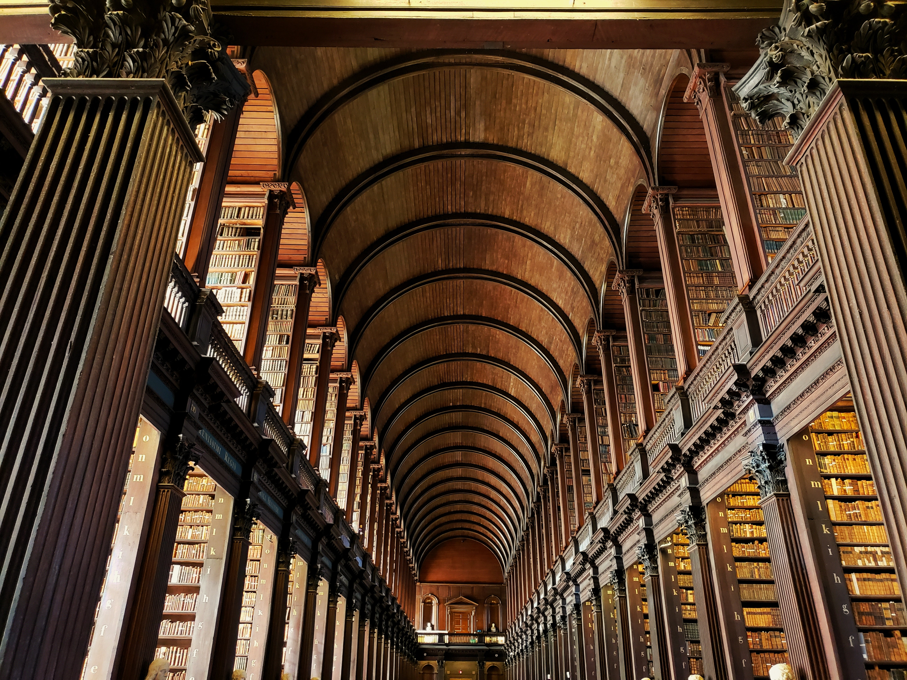
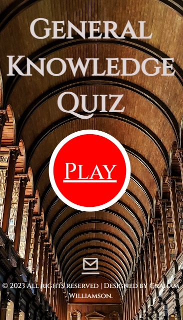

# Welcome to my Project 2 README page

<ul class="navlist">
                <li><a href="#my project 2">My Project 2</a></li>
                <li><a href="#design">Design</a></li>
                <li><a href="#location">Location</a></li>
                <li><a href="#deployment">Deployment</a></li>
                <li><a href="#validation">Validation</a></li>
                <li><a href="#testing">Testing</a></li>
                <li><a href="#tools">Tools</a></li>
                <li><a href="#course">Course</a></li>
                <li><a href="#books">Books</a></li>
                <li><a href="#acknowledgement">Acknowledgement</a></li>
            </ul>

# [My Project 2](http://project2.grahamwilliamson.ie)  General Knowledge Quiz

Hi! My name is Graham. In this README page were you will find out a little about me, my website, my coding journey, my projects and who has influenced me in the development of this website.

This is my second course project, by now I have gained a little experience but still very much a novice. Of the options for this project I thought a quiz would be fun with the challenging bit of writing good questions.

My code for this project was originally heavily influenced by The WebShala [YouTube](https://www.youtube.com/@TheWebShala) channel but this 2.0 version is a much more individual effort.

I hope you have fun.

# Design.

For this project I decided to do a quiz as I love a good pub quiz. Quiz's in general can be very enjoyable and hopefully I acheived that. The color scheme for this website is very much tied in with the background image, the chocolate colored font adding some warmth with the light grey adding a bit of contrast. The font used on this project is <u>Cinzel</u>, I choosed this font as I think it adds some sharpness to the overall look. My process of constructing this project was to source all images, including favicon, draw up a mock layout then begin with the HTML. To dress everything up, CSS was added and to make it all dance, Javascript provided all the glitz and glamour.

# Main Page.
The man page has a lovely background of the Trinity College Library, imaged sourced from Unsplash [Website](https://unsplash.com/s/photos/trinity-college).

 In the center containing the Play button. A basic main page with only the essentials with a contrasting red button that turns green when hovered over, just waiting to be pressed. At the bottom contains the copyright and an animated icon for email contact.

Mobile Phone Screen.

Green Play Button.

## <b> Questions Page:</b>
The question page has the same background as the main page with the question box centered. All questions are provided by Open Trivia Database [Website](https://opentdb.com/). This box will contain a question and multiple choice answers. When you select your answer, click the Submit button to be taken to the next question.

All data provided by the API is available under the Creative Commons Attribution-ShareAlike 4.0 International License.

## <b>Leaderboard Page:</b>
The leaderboard page will show your score and your standings,
this page also includes a Start Again button to return you to the start page.

## <b>Favicon:</b>
To finish off the design of this website, I added a favicon of a cartoon brain as a sign of intellegence with a dash of fun.

# Location

All my projects are also available to view on my portfolio website.
[www.grahamwilliamson.ie](http://grahamwilliamson.ie)

# Deployment

### The site was deployed to Github. The step are as follows:
<ol>
<li>In the Github repository, go to setting.</li>
<li>In settings go to the pages tab, located on the left.</li>
<li>Under source, select the branch to master and click save.</li>
<li>When the master branch has been selected, the page will refresh ti indicate the successful deployment.</li>
</ol>

#### Github link found here - [github.com]( https://grahamwilliamson234.github.io/my_quiz)
#### Live link found here - [project2.grahamwilliamson.ie](https://project2.grahamwilliamson.ie)

