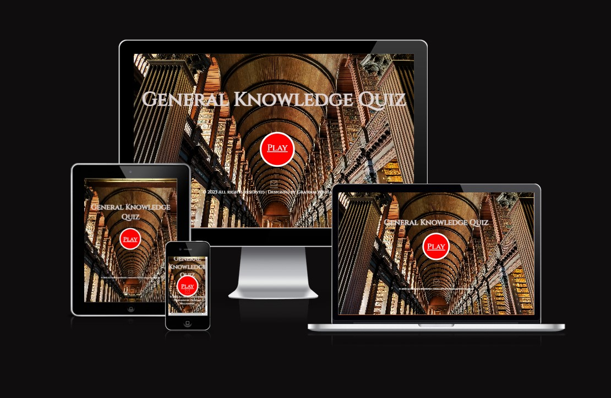

# Welcome to my Project 2 README page

<ul class="navlist">
                <li><a href="#my project 2">My Project 2</a></li>
                <ul>
                    <li><a href="#aims">Aims</a></li>
                    <li><a href="#flow-chart">Flow Chart</a></li>
                </ul>
                <li><a href="#design">Design</a></li>
                <ul>
                    <li><a href="#main-page">Main Page</a></li>
                    <li><a href="#questions">Questions Page</a></li>
                    <li><a href="#leaderboard">Leaderboard Page</a></li>
                    <li><a href="#favicon">Favicon</a></li>
                </ul>
                <li><a href="#location">Location</a></li>
                <li><a href="#deployment">Deployment</a></li>
                <ul>
                    <li><a href="#clone-repository">Clone Repository</a></li>
                    <li><a href="#fork-repository">Fork Repository</a></li>
                </ul>
                <li><a href="#validation">Validation</a></li>
                <li><a href="#testing">Testing</a></li>
                <li><a href="#tools">Tools</a></li>
                <li><a href="#course">Course</a></li>
                <li><a href="#books">Books</a></li>
                <li><a href="#acknowledgement">Acknowledgement</a></li>
            </ul>

# [My Project 2](http://project2.grahamwilliamson.ie)  General Knowledge Quiz

Hi! My name is Graham. In this README page were you will find out a little about me, my website, my coding journey, my projects and who has influenced me in the development of this website.

This is my second course project, by now I have gained a little experience but still very much a novice. Of the options for this project I thought a quiz would be fun with the challenging bit of writing good questions.

My code for this project was originally heavily influenced by The WebShala [YouTube](https://www.youtube.com/@TheWebShala) channel but this 2.0 version is a much more individual effort.

I hope you have fun.

# Design.

For this project I decided to do a quiz as I love a good pub quiz. Quiz's in general can be very enjoyable and hopefully I acheived that. The color scheme for this website is very much tied in with the background image, the chocolate colored font adding some warmth with the light grey adding a bit of contrast. The font used on this project is <u>Cinzel</u>, I choosed this font as I think it adds some sharpness to the overall look. My process of constructing this project was to source all images, including favicon, draw up a mock layout then begin with the HTML. To dress everything up, CSS was added and to make it all dance, Javascript provided all the glitz and glamour.

# Main Page.
The man page has a lovely background of the Trinity College Library, imaged sourced from Unsplash [Website](https://unsplash.com/s/photos/trinity-college).

 In the center containing the Play button. A basic main page with only the essentials with a contrasting red button that turns green when hovered over, just waiting to be pressed. At the bottom contains the copyright and an animated icon for email contact.

Mobile Phone Screen.

Green Play Button.

## <b> Questions Page:</b>
The question page has the same background as the main page with the question box centered. All questions are provided by Open Trivia Database [Website](https://opentdb.com/). This box will contain a question and multiple choice answers. When you select your answer, click the Submit button to be taken to the next question.

All data provided by the API is available under the Creative Commons Attribution-ShareAlike 4.0 International License.

## <b>Leaderboard Page:</b>
The leaderboard page will show your score and your standings,
this page also includes a Start Again button to return you to the start page.

## <b>Favicon:</b>
To finish off the design of this website, I added a favicon of a cartoon brain as a sign of intellegence with a dash of fun.

# Location

All my projects are also available to view on my portfolio website.
[www.grahamwilliamson.ie](http://grahamwilliamson.ie)

# Deployment

### The site was deployed to Github. The step are as follows:
<ol>
<li>In the Github repository, go to setting.</li>
<li>In settings go to the pages tab, located on the left.</li>
<li>Under source, select the branch to master and click save.</li>
<li>When the master branch has been selected, the page will refresh ti indicate the successful deployment.</li>
</ol>

#### Github link found here - [github.com](https://grahamwilliamson234.github.io/project2/)
#### Live link found here - [project2.grahamwilliamson.ie](http://project2.grahamwilliamson.ie)

## Clone Repository
The project started to be developed by cloning the mock terminal repository provided by the Code Institute. The cloning phase of the project is as follows:

Go to the GitHub repository to be cloned. Click the 'Use this template' text and and then click 'Create a new repository' in the dropdown menu that opens.

The following will open on a new page. After specifying the repository name, you can create the repository without writing a description. The new repository will be created automatically.

Then, if you want, you can open with the GitPod or clone it to your computer and work on locally. Since I am running locally, I will explain how I cloned it to the computer. As in the first step, we press the 'Code' button, open the dropdown menu and copy the link indicated by the arrow.

Then, we open the terminal application we use from the computer and clone the repository to our computer with the 'git clone -link to be cloned-' command. Then you can develope your work using the source-code editor of your choice.

## Fork GitHub Repository

To fork a GitHub repo, see the [Fork a GitHub repo](https://docs.github.com/en/get-started/quickstart/fork-a-repo) documentation.

# Validation
To ensure the functionality of this project I had 4 tasks.
1. HTML Validation
<input type="checkbox" input checked>
<li>HTML <ul style="list-style-type:circle"><li>No errors returned on W3C HTML validator.</li></ul>

2. CSS Validation
<input type="checkbox" input checked>
<li>CSS <ul style="list-style-type:circle"><li>No errors returned on W3C CSS validator.</li></ul>

3. JSHint Check
<input type="checkbox" input checked>
<li>Javascript <ul style="list-style-type:circle"><li>No errors returned on JSHint validator.</li></ul>

4. Lighthouse Accessibility
<input type="checkbox" input checked>
<li>Accessibility <ul style="list-style-type:circle"><li>On website inspection, lighthouse results are shown below:</li></ul>
</li>
</ul>

# Testing 
Code continuously tested my throught the process.
<ul>
<li>Each step tested to ensure viability.</li>
<li>I have played the game several times to check its useability.</li>
</ul>

#### Quiz tested on multiple browers such as Chrome, Firefox and Edge, the only issue is relating to question bank api - see Bugs.

## Bugs

As each bit of code was tested throughout, any bugs found were corrected.
To ensure this tasks efficiency, the functionality of the code was check regularly.

The only bug remaining is an encoding problem with the question bank from Open Trivia Database [Website](https://opentdb.com/). I have looked for the solution on multiple sources such as stackoverflow [Website](https://stackoverflow.com/questions/59920487/opentdb-weird-characters). This link provided code to solve the problem, unfortunately I was unsuccessful in using this code. Bug remains.

# Tools

This project used HTML5, CSS3 and Javascript.

# Course

## Professional Diploma in Full Stack Software Development
### University College Dublin [Website](https://www.ucd.ie/professionalacademy/why-ucd-professional-academy/)

### Code Institute [Website](https://codeinstitute.net/ie/full-stack-software-development-diploma/?utm_term=code%20institute&utm_campaign=CI+-+IRL+-+Search+-+Brand&utm_source=adwords&utm_medium=ppc&hsa_acc=8983321581&hsa_cam=14304747355&hsa_grp=128775288169&hsa_ad=595155717776&hsa_src=g&hsa_tgt=kwd-342001843376&hsa_kw=code%20institute&hsa_mt=p&hsa_net=adwords&hsa_ver=3&gclid=Cj0KCQjwnvOaBhDTARIsAJf8eVOdV0BAxB5DwdTrFB9AvR5tJ73tLtvCsSeHDsSSq9e1gNbiXiNLTZQaAkyKEALw_wcB)

 

# Books

### Mike McGrath - HTML, CSS & Javascript (Special Edition) [Amazon](https://www.amazon.co.uk/HTML-CSS-JavaScript-easy-steps/dp/184078878X/ref=asc_df_184078878X/?tag=googshopuk-21&linkCode=df0&hvadid=430989472982&hvpos=&hvnetw=g&hvrand=4859645684734044070&hvpone=&hvptwo=&hvqmt=&hvdev=c&hvdvcmdl=&hvlocint=&hvlocphy=20487&hvtargid=pla-921516488553&psc=1&th=1&psc=1&tag=&ref=&adgrpid=97419294662&hvpone=&hvptwo=&hvadid=430989472982&hvpos=&hvnetw=g&hvrand=4859645684734044070&hvqmt=&hvdev=c&hvdvcmdl=&hvlocint=&hvlocphy=20487&hvtargid=pla-921516488553)

### Jon Duckett - HTML & CSS, design and build websites [Amazon](https://www.amazon.co.uk/HTML-CSS-Design-Build-Websites/dp/1118008189/ref=asc_df_1118008189/?tag=googshopuk-21&linkCode=df0&hvadid=310831942794&hvpos=&hvnetw=g&hvrand=9245307914514372249&hvpone=&hvptwo=&hvqmt=&hvdev=c&hvdvcmdl=&hvlocint=&hvlocphy=20487&hvtargid=pla-425752469964&psc=1&th=1&psc=1)

### Jon Duckett - JAVASCRIPT & JQUERY interactive front-end web development [Amazon](https://www.amazon.co.uk/JavaScript-JQuery-Interactive-Front-End-Development/dp/1118531647)

 

# Acknowledgement

### The WebShala [YouTube](https://www.youtube.com/@TheWebShala)
For the initial idea for this project, I relied heavily on this channel for assistance on the Javascript section of this project.
### Mike Dane [Website](https://www.mikedane.com/) [YouTube](https://www.youtube.com/c/GiraffeAcademy)
I am a big follower of this channel, my go to for inspiration. Mike Dane, in my opinion, is a great teacher.
### W3 School [Website](https://www.w3schools.com/js/default.asp)
W3 Schools web-site has it all, I would have benn lost many times without there help.

As well as the Code Institute course content, and as with my first project, I got inspiration from some
online tutorials and video's and also books such as  books from Mike McGraths and video tutorials from Mike Dane.

At times I found Javascript challenging and I needed to dig deep into my resourses, thankfully there are so many online tutorials out there to help.

The India based YouTube channel'The WebShala'was of great help on the project with so many helpful and inspiring tutorials. My thanks to The WebShala.

### Font Awesome [Website](https://fontawesome.com/search)
### Boxicons [Website](https://boxicons.com/)
### Github [Website](https://github.com/)
### Slack [Website](https://slack.com/intl/en-ie/)
### stackoverflow [Website](https://stackoverflow.com/)

